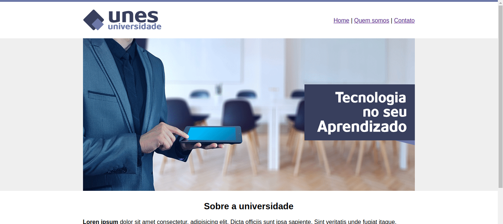

<!-- Logo do Projeto -->

<h1 align="center">
    
</h1>

<!-- Slogan do Projeto -->

<em>"Tecnologia no seu aprendizado"</em>

<!-- Sumario do Projeto -->

    <a href="#desktop_computer-sobre-o-projeto">Sobre</a> | 
    <a href="#page_facing_up-proposta">Proposta</a> | 
    <a href="#hammer_and_wrench-tecnologias">Tecnologias</a> | 
    <a href="#fountain_pen-autor">Autor</a> | 
    <a href="#hearts-agradecimentos">Agradecimentos</a> | 
    <a href="#pencil-licença">Licença</a>

<!-- Status do Projeto -->

<h3 align="center"> 🚧 Universidade UNES 🙆‍♂️ Concluído 🚧 </em></h3>

<!-- Informações do Projeto -->

## :desktop_computer: Sobre o projeto

O projeto **Universidade UNES** foi desenvolvido no curso **Desenvolvimento Web FullStack Com Python e Django**, ministrado pelo professor **Jamilton Damasceno**.

## :page_facing_up: Proposta

A proposta do projeto se consiste em utilizar tabelas para a composição da pagina HTML.

## :hammer_and_wrench: Tecnologias

### Front-End

- **[HTML5](https://www.w3.org/html/)**

## :fountain_pen: Autor

João Tsukahara

## :hearts: Agradecimentos

Jamilton Damasceno

## :pencil: Licença

Projeto sobe a licença  [MIT](./LICENSE).
